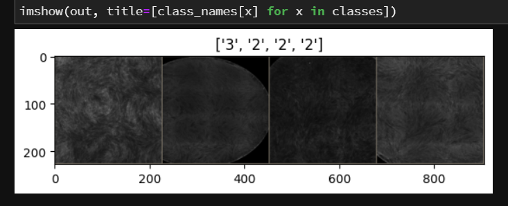
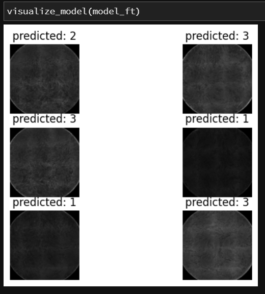
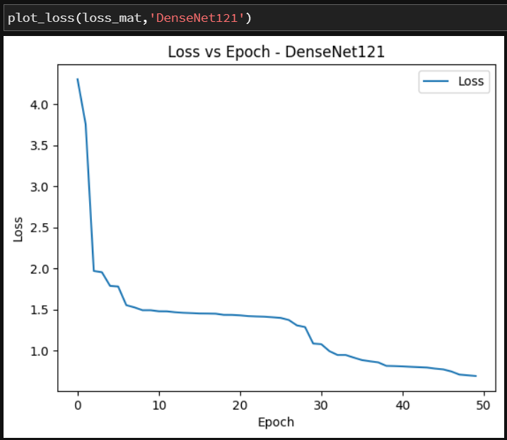
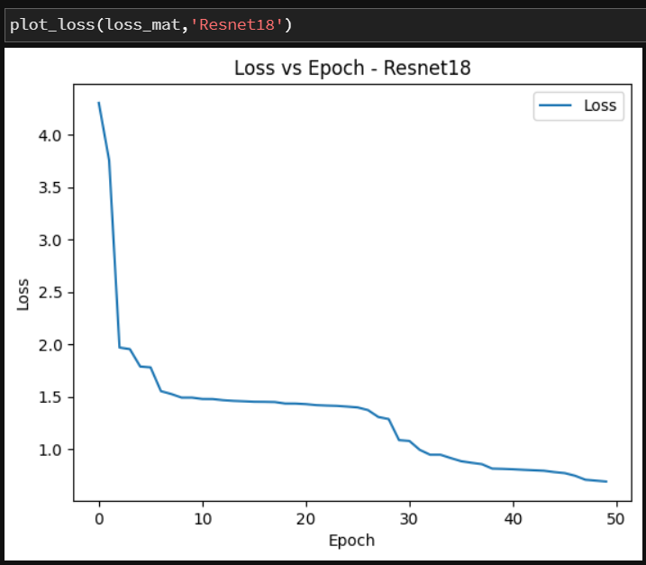
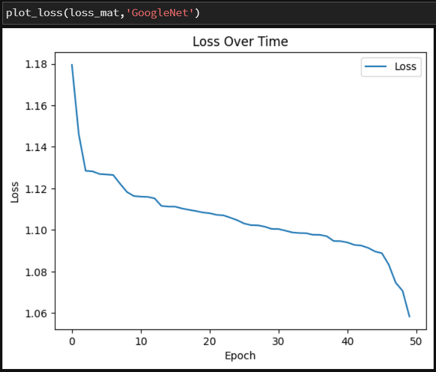

---

# Senescence Detection of Mesenchymal Stem Cells

This project aims to detect senescent mesenchymal stem cells (MSCs) using pre-trained models such as DenseNet121, ResNet18, GoogLeNet, and Faster R-CNN. The study evaluates these models' performance on images obtained from Olympus fluorescence microscopes.

## Table of Contents
- [Introduction](#introduction)
- [Methodology](#methodology)
  - [Data Collection and Pre-processing](#data-collection-and-pre-processing)
  - [Model Architectures](#model-architectures)
  - [Training Procedure](#training-procedure)
  - [Evaluation Metrics](#evaluation-metrics)
- [Results](#results)
  - [Loss vs. Epochs Graphs](#loss-vs-epochs-graphs)
  - [Model Performance Comparison](#model-performance-comparison)
- [Conclusion](#conclusion)
- [Future Work](#future-work)
- [References](#references)

## Introduction
Mesenchymal stem cells (MSCs) are crucial for regenerative medicine due to their ability to differentiate into various cell types and their immunomodulatory properties. Detecting senescent MSCs is essential as they exhibit reduced therapeutic potential. This project employs advanced deep learning techniques to accurately identify senescent MSCs.

## Methodology

### Data Collection and Pre-processing
# DATA:
Training data is shifted to MASTER branch. 
The dataset comprises images from five donors at different time points, each stained for actin and nucleus. Images were captured using an Olympus IX83 fluorescence microscope and pre-processed to remove artifacts and standardize the dataset.
 - 1 - Senescent
 - 2 - Moderately Senescent
 - 3 - Non-Senescent
 - 

### Model Architectures
We utilized the following pre-trained models:
- **DenseNet121**
- **ResNet18**
- **GoogLeNet**
- **Faster R-CNN**

### Training Procedure
We fine-tuned the pre-trained models using the following techniques:
- **Optimizer**: Stochastic Gradient Descent (SGD) and Adam
- **Learning Rate Scheduling**: To prevent overfitting
- **Loss Function**: Cross-entropy loss for classification

### Evaluation Metrics
The models were evaluated using accuracy, precision and recall. Confusion matrices were used to analyze the classification performance in detail.

## Results
### Predicted Images along with their classes:

### Loss vs. Epochs Graphs

### Model Performance Comparison
| Model       | Accuracy | Precision | Recall |
|-------------|----------|-----------|--------|
| ResNet18    | 91.6%    | 80.2%     | 86.5%  |
| DenseNet121 | 84.5%    | 70.6%     | 88.6%  |
| GoogLeNet   | 76.8%    | 74.3%     | 69.7%  |
| Faster R-CNN| 71.4%    | 70.6%     | 65.7%  |

## Conclusion
The Faster R-CNN model demonstrated the highest accuracy in detecting senescent MSCs, making it the most effective model for this task. The other models also showed competitive performance, indicating the robustness of deep learning techniques in this domain.

## Future Work
Future research could explore integrating multi-omics data, transfer learning techniques, and validating model performance on clinical samples. Additionally, optimizing models for real-time analysis and developing interactive visualization tools are promising directions.

## References
- [Kim et al.](#) - Deep learning for MSC screening
- [He et al.](#) - Morphology-based senescence detection
- [Liu et al.](#) - Machine learning for cartilage repair
- [PaddleDetection](#) - Cascade R-CNN configurations

---
